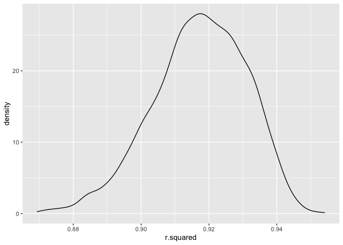
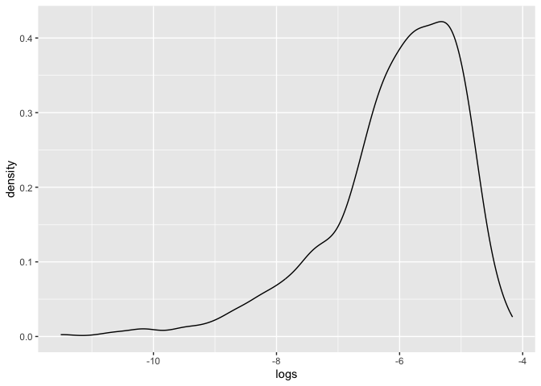
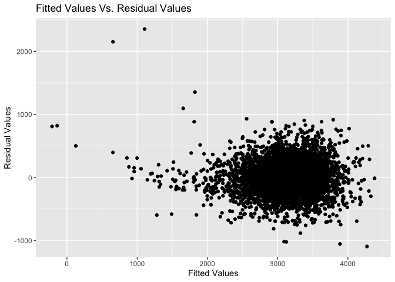
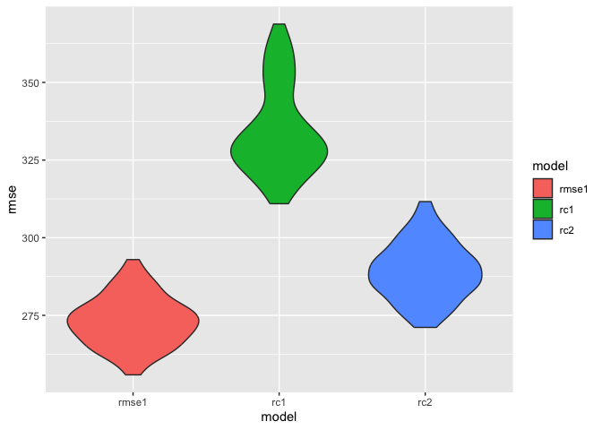

p8105_hw5_lel2176
================
Lauren Lazaro
2023-12-01

``` r
library(tidyverse)
```

    ## ── Attaching core tidyverse packages ──────────────────────── tidyverse 2.0.0 ──
    ## ✔ dplyr     1.1.3     ✔ readr     2.1.4
    ## ✔ forcats   1.0.0     ✔ stringr   1.5.0
    ## ✔ ggplot2   3.4.3     ✔ tibble    3.2.1
    ## ✔ lubridate 1.9.2     ✔ tidyr     1.3.0
    ## ✔ purrr     1.0.2     
    ## ── Conflicts ────────────────────────────────────────── tidyverse_conflicts() ──
    ## ✖ dplyr::filter() masks stats::filter()
    ## ✖ dplyr::lag()    masks stats::lag()
    ## ℹ Use the conflicted package (<http://conflicted.r-lib.org/>) to force all conflicts to become errors

``` r
library(rnoaa)
```

    ## The rnoaa package will soon be retired and archived because the underlying APIs have changed dramatically. The package currently works but does not pull the most recent data in all cases. A noaaWeather package is planned as a replacement but the functions will not be interchangeable.

``` r
library(janitor)
```

    ## 
    ## Attaching package: 'janitor'
    ## 
    ## The following objects are masked from 'package:stats':
    ## 
    ##     chisq.test, fisher.test

``` r
library(MASS)
```

    ## 
    ## Attaching package: 'MASS'
    ## 
    ## The following object is masked from 'package:dplyr':
    ## 
    ##     select

``` r
library(modelr)
```

# Problem 2

``` r
weather_df = 
  rnoaa::meteo_pull_monitors(
    c("USW00094728"),
    var = c("PRCP", "TMIN", "TMAX"), 
    date_min = "2022-01-01",
    date_max = "2022-12-31") |>
  mutate(
    name = recode(id, USW00094728 = "CentralPark_NY"),
    tmin = tmin / 10,
    tmax = tmax / 10) |>
   dplyr::select(name, id, everything())
```

    ## using cached file: /Users/laurenlazaro/Library/Caches/org.R-project.R/R/rnoaa/noaa_ghcnd/USW00094728.dly

    ## date created (size, mb): 2023-09-28 10:18:39.207418 (8.524)

    ## file min/max dates: 1869-01-01 / 2023-09-30

``` r
bootstraps = weather_df |> 
  modelr::bootstrap(n = 5000) |> 
  mutate(
    model = map(strap, \(df) lm(tmax ~ tmin + prcp, data = df)),
    result = map(model, broom::tidy),
    r2 = map(model, broom::glance)) |> 
  dplyr::select(result, r2) %>% unnest(r2) |> 
  dplyr::select(result, r.squared) %>% unnest(result) |> 
  dplyr::select(term, estimate, r.squared) 

bootstraps |> 
  filter(term == "(Intercept)") |> 
  ggplot(aes(x = r.squared)) +
  geom_density()
```

<!-- -->

``` r
CI = bootstraps |> 
  filter(term == "(Intercept)") |> 
  dplyr::select(r.squared) |> 
  summarize(lower = quantile(r.squared, 0.025), 
            upper = quantile(r.squared, 0.975))

CI
```

    ## # A tibble: 1 × 2
    ##   lower upper
    ##   <dbl> <dbl>
    ## 1 0.887 0.940

The data is centered around 0.92 and is skewed to the left. We are 95%
confident that the R-squared value is between 0.8872361 and 0.940484

``` r
bootstraps |> 
  pivot_wider(names_from = term, values_from = estimate) |>  
  rename(b1 = tmin, 
         b2 = prcp) |>  
  mutate(logs = log(b1 * b2)) |>  
  ggplot(aes(x = logs)) + 
  geom_density()
```

    ## Warning: There was 1 warning in `mutate()`.
    ## ℹ In argument: `logs = log(b1 * b2)`.
    ## Caused by warning in `log()`:
    ## ! NaNs produced

    ## Warning: Removed 3382 rows containing non-finite values (`stat_density()`).

<!-- -->

``` r
CI_b1b2 = bootstraps |> 
  pivot_wider(names_from = term, values_from = estimate) |>  
  rename(b1 = tmin, 
         b2 = prcp) |>  
  mutate(logs = log(b1 * b2)) |> 
  summarize(NA_num = sum(is.na(logs)),
            lower = quantile(logs, 0.025, na.rm = T), 
            upper = quantile(logs, 0.975, na.rm = T))
```

    ## Warning: There was 1 warning in `mutate()`.
    ## ℹ In argument: `logs = log(b1 * b2)`.
    ## Caused by warning in `log()`:
    ## ! NaNs produced

``` r
CI_b1b2
```

    ## # A tibble: 1 × 3
    ##   NA_num lower upper
    ##    <int> <dbl> <dbl>
    ## 1   3382 -8.79 -4.60

The data skewed to the left with a peak in between -6 and -5.

# Problem 3

``` r
birthweight =
  read_csv("./data/birthweight.csv") |> 
  mutate(
    babysex = as.factor(babysex),
    babysex = fct_recode(
      babysex, 
      "male" = "1", 
      "female" = "2"
      ),
    frace = as.factor(frace),
    frace = fct_recode(
      frace, 
      "white" = "1", 
      "black" = "2", 
      "asian" = "3", 
                       
      "puerto rican" = "4", 
      "other" = "8"),
    malform = as.logical(malform),
    mrace = as.factor(mrace),
    mrace = fct_recode(
      mrace, 
      "white" = "1", 
      "black" = "2", 
                       
      "asian" = "3", 
      "puerto rican" = "4")
    ) |> 
  drop_na()
```

    ## Rows: 4342 Columns: 20
    ## ── Column specification ────────────────────────────────────────────────────────
    ## Delimiter: ","
    ## dbl (20): babysex, bhead, blength, bwt, delwt, fincome, frace, gaweeks, malf...
    ## 
    ## ℹ Use `spec()` to retrieve the full column specification for this data.
    ## ℹ Specify the column types or set `show_col_types = FALSE` to quiet this message.

``` r
lm =
  lm(bwt ~., data = birthweight)

step =
  stepAIC(lm, direction = "backward", trace = FALSE)

step |> 
  broom::tidy() |> 
  knitr::kable()
```

| term              |      estimate |   std.error |  statistic |   p.value |
|:------------------|--------------:|------------:|-----------:|----------:|
| (Intercept)       | -6098.8219113 | 137.5463421 | -44.340124 | 0.0000000 |
| babysexfemale     |    28.5580171 |   8.4548958 |   3.377690 | 0.0007374 |
| bhead             |   130.7770408 |   3.4465672 |  37.944144 | 0.0000000 |
| blength           |    74.9471109 |   2.0190479 |  37.120027 | 0.0000000 |
| delwt             |     4.1067316 |   0.3920592 |  10.474775 | 0.0000000 |
| fincome           |     0.3180229 |   0.1747477 |   1.819898 | 0.0688436 |
| gaweeks           |    11.5924873 |   1.4620657 |   7.928842 | 0.0000000 |
| mheight           |     6.5940377 |   1.7848817 |   3.694383 | 0.0002231 |
| mraceblack        |  -138.7924801 |   9.9070869 | -14.009414 | 0.0000000 |
| mraceasian        |   -74.8867755 |  42.3146313 |  -1.769761 | 0.0768374 |
| mracepuerto rican |  -100.6781427 |  19.3246910 |  -5.209819 | 0.0000002 |
| parity            |    96.3046933 |  40.3362158 |   2.387549 | 0.0170038 |
| ppwt              |    -2.6755853 |   0.4273585 |  -6.260752 | 0.0000000 |
| smoken            |    -4.8434197 |   0.5855757 |  -8.271210 | 0.0000000 |

``` r
birthweight |>  
  add_predictions(step) |>  
  add_residuals(step) |>  
  ggplot(aes(x = pred, y = resid)) + 
  geom_point() +
  labs(title = "Fitted Values Vs. Residual Values", 
       x = "Fitted Values",
       y = "Residual Values")
```

<!-- -->

``` r
comp1 =
  lm(bwt ~ blength + gaweeks, data = birthweight) |> 
  broom::tidy() |> 
  knitr::kable()

comp2 =
  lm(bwt ~ bhead*blength*babysex, data = birthweight) |> 
  broom::tidy() |> 
  knitr::kable()

CV =
  crossv_mc(birthweight, 100) |> 
  mutate(
    test = map(test, as_tibble),
    train = map(train, as_tibble) 
    )

comp_CV =
  CV |>  
  mutate(
    mod1  = map(
      train, 
      ~lm(bwt ~ babysex + bhead + blength + delwt + fincome + 
    gaweeks + mheight + mrace + parity + ppwt + smoken, data = .x)),
    mod2  = map(train, ~lm(bwt ~ gaweeks + blength, data = .x)),
    mod3  = map(train, ~lm(bwt ~ bhead*blength*babysex, data = .x))
    ) |>  
  mutate(
    rmse1 = map2_dbl(mod1, test, ~rmse(model = .x, data = .y)),
    rmse2  = map2_dbl(mod2, test, ~rmse(model = .x, data = .y)),
    rmse3 = map2_dbl(mod3, test, ~rmse(model = .x, data = .y))
    ) |>  
  summarize(
    avg_mod1 = mean(rmse1),
    avg_mod2 = mean(rmse2),
    avg_mod3 = mean(rmse3)
    )

comp_CV
```

    ## # A tibble: 1 × 3
    ##   avg_mod1 avg_mod2 avg_mod3
    ##      <dbl>    <dbl>    <dbl>
    ## 1     273.     334.     289.

``` r
CV |>  
  mutate(
    mod1  = 
      map(train, ~lm(bwt ~ babysex + bhead + blength + delwt + fincome + 
                       gaweeks + mheight + mrace + parity + ppwt + smoken, 
                     data = .x)),
         mc1  = map(train, ~lm(bwt ~ gaweeks + blength, data = .x)),
         mc2  = map(train, ~lm(bwt ~ bhead*blength*babysex, data = .x))
    ) |>  
  mutate(
    rmse1 = map2_dbl(mod1, test, ~rmse(model = .x, data = .y)),
         rc1  = map2_dbl(mc1, test, ~rmse(model = .x, data = .y)),
         rc2 = map2_dbl(mc2, test, ~rmse(model = .x, data = .y))
    ) |> 
  dplyr::select(rmse1, rc1, rc2) |>   
  pivot_longer(everything(),
               names_to = "model", 
               values_to = "rmse",
               names_prefix = "rmse_") |> 
  mutate(
    model = fct_inorder(model)
    ) |>  
  ggplot(aes(x = model, y = rmse)) + 
  geom_violin(aes(fill = model))
```

<!-- -->
